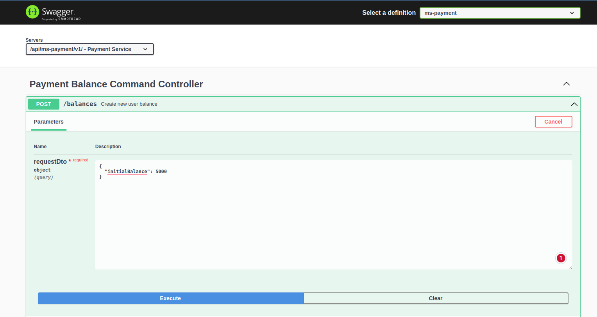
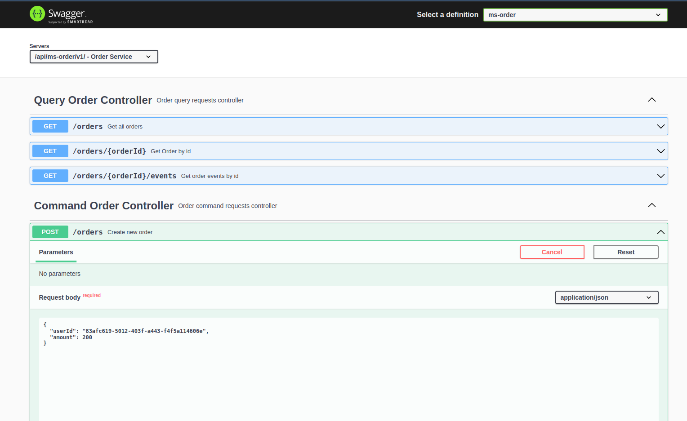

## Saga Orchestration Pattern Using Event Sourcing and CQRS

### Start Postgres and Axon Server

`docker compose up -d`

## Saga Lifecycle
**Happy path:** CreateOrderCommand -> CommandCreatedEvent -> ProcessPaymentCommand -> PaymentProcessedEvent -> CreateShipmentCommand -> ShipmentCreatedEvent -> UpdateOrderStatusCommand(ORDER_COMPLETED) -> OrderStatusUpdatedEvent

**Compensations:** 

1. Payment Failed: PaymentFailedEvent -> UpdateOrderStatusCommand(ORDER_FAILED) -> OrderStatusUpdatedEvent
2. Shipment Failed: ShipmentCreatedEvent(SHIPMENT_FAILED) -> CancelPaymentCommand -> PaymentCancelledEvent -> UpdateOrderStatusCommand(ORDER_FAILED) -> OrderStatusUpdatedEvent

## Api Docs
Using Api Gateway: http://localhost:5555/docs

## Test cases
1. First Create a User Balance with balance 5000 for example:

Copy the returned user id for order creation

### Happy test

Create order with an amount less than user balance: 200 for example.

2. Create order

### Payment Failure
Create an order with amount greater than user balance.

### Shipment Failure
Failure is hard coded in Shipment Service (Service fails for any order with amount less than 20).